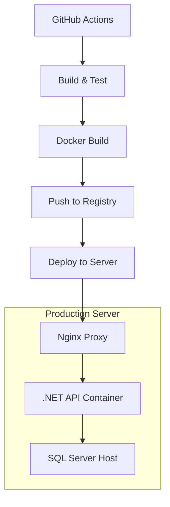

# OlloLifestyle API - CI/CD Deployment Guide

## 🚀 Complete Production Deployment Setup

This guide provides comprehensive instructions for deploying the OlloLifestyle .NET 9 Web API to production using GitHub Actions CI/CD pipeline with Docker containers and Nginx reverse proxy.

## 📋 Prerequisites

### Server Requirements
- **OS**: Ubuntu 20.04 LTS
- **Server**: OLLO-PROD-SVR (192.168.50.98)
- **User**: olloadmin
- **Docker**: Community Edition (installed)
- **SQL Server**: Installed locally on port 1433

### GitHub Repository Setup
Your repository must have the following secrets configured:

```
SSH_PRIVATE_KEY     - Private SSH key for server access
JWT_SECRET_KEY      - JWT secret key (minimum 32 characters)
DB_PASSWORD         - SQL Server password
GITHUB_TOKEN        - GitHub token for container registry (automatically provided)
```

## 🛠️ Server Initial Setup

### Step 1: Run Server Setup Script

Connect to your server and run the setup script:

```bash
# SSH to your server
ssh olloadmin@192.168.50.98

# Clone the repository or copy the setup script
wget https://raw.githubusercontent.com/your-org/your-repo/main/scripts/server-setup.sh
chmod +x server-setup.sh
./server-setup.sh
```

This script will:
- ✅ Install required packages (Docker, Nginx, etc.)
- ✅ Configure firewall (UFW)
- ✅ Create application directory structure
- ✅ Generate self-signed SSL certificates
- ✅ Set up log rotation
- ✅ Create systemd service
- ✅ Configure automated backups

### Step 2: Configure Environment Variables

```bash
# Copy environment template
cp /opt/ollo-api/.env.template /opt/ollo-api/.env

# Edit with your actual values
nano /opt/ollo-api/.env
```

**Required environment variables:**
```env
JWT_SECRET_KEY=your-super-secure-jwt-secret-key-here
DB_PASSWORD=Ollo@123#2025$
ASPNETCORE_ENVIRONMENT=Production
IMAGE_TAG=latest
```

### Step 3: Verify Server Setup

```bash
# Check system status
/opt/ollo-api/monitor.sh

# Test manual deployment
cd /opt/ollo-api
/opt/ollo-api/scripts/deploy-manual.sh status
```

## 🔄 CI/CD Pipeline

### Automated Deployment Workflow

The GitHub Actions pipeline includes:

1. **Build Stage**: 
   - Restores NuGet packages
   - Builds the .NET 9 application
   - Runs code analysis
   - Generates versioned artifacts

2. **Docker Stage**: 
   - Builds Docker image
   - Pushes to GitHub Container Registry
   - Tags with version and latest

3. **Deploy Stage**: 
   - Deploys to production server
   - Updates SSL certificates
   - Performs health checks
   - Automatic rollback on failure

### Triggering Deployments

**Automatic deployment** occurs on push to `master` or `main` branch:
```bash
git push origin master
```

**Manual rollback** can be triggered via GitHub Actions UI or API:
```bash
# Via GitHub CLI
gh workflow run ci-cd.yml --ref main
```

## 🏗️ Architecture Overview



### Network Configuration

| Service | Port | Protocol | Access |
|---------|------|----------|--------|
| Nginx (HTTPS) | 443 | HTTPS | External |
| Nginx (HTTP) | 80 | HTTP | Redirects to HTTPS |
| Nginx (Internal) | 8081 | HTTP | Internal testing |
| .NET API | 8080 | HTTP | Container only |
| SQL Server | 1433 | TCP | Host machine |

## 🔒 Security Configuration

### SSL/TLS
- **HTTPS Enforced**: All HTTP traffic redirects to HTTPS
- **TLS Versions**: 1.2 and 1.3 supported
- **Certificates**: Self-signed for internal use
- **HSTS**: Enabled with 1-year max-age

### Firewall Rules
```bash
# UFW Configuration
sudo ufw allow ssh
sudo ufw allow 80/tcp
sudo ufw allow 443/tcp
sudo ufw allow 8081/tcp
sudo ufw enable
```

### Rate Limiting
- **Auth endpoints**: 5 requests/second
- **API endpoints**: 10 requests/second
- **General**: 20 requests/second

## 📊 Monitoring & Health Checks

### Health Check Endpoints
- **HTTPS**: `https://192.168.50.98/health`
- **HTTP Internal**: `http://192.168.50.98:8081/health`

### Monitoring Script
```bash
# System status overview
/opt/ollo-api/monitor.sh

# Detailed health check
/opt/ollo-api/health-check.sh
```

### Log Locations
- **Application logs**: `/opt/ollo-api/logs/`
- **Nginx logs**: `/opt/ollo-api/nginx/logs/`
- **Deployment logs**: `/opt/ollo-api/logs/deploy-*.log`

## 🔧 Manual Operations

### Manual Deployment
```bash
# Deploy latest version
/opt/ollo-api/scripts/deploy-manual.sh deploy

# Check deployment status
/opt/ollo-api/scripts/deploy-manual.sh status

# View application logs
/opt/ollo-api/scripts/deploy-manual.sh logs

# Rollback to previous version
/opt/ollo-api/scripts/deploy-manual.sh rollback
```

### Container Management
```bash
cd /opt/ollo-api

# View container status
docker-compose ps

# View logs
docker-compose logs -f olloapi

# Restart services
docker-compose restart

# Update and restart
docker-compose pull && docker-compose up -d
```

### Backup Operations
```bash
# Manual backup
/opt/ollo-api/backup.sh

# View available backups
ls -la /opt/ollo-api/backups/

# Automated backups run daily at 2 AM via cron
```

## 🚨 Troubleshooting

### Common Issues

#### 1. Containers not starting
```bash
# Check logs
docker-compose logs

# Check system resources
docker system df
free -h

# Cleanup and retry
docker system prune -f
docker-compose up -d
```

#### 2. Health check failures
```bash
# Check container health
docker ps

# Check application logs
docker-compose logs olloapi

# Test endpoints manually
curl -k https://localhost/health
curl http://localhost:8081/health
```

#### 3. SSL certificate issues
```bash
# Regenerate certificates
cd /opt/ollo-api
openssl req -x509 -nodes -days 365 -newkey rsa:2048 \
  -keyout ssl/private/ollo-api.key \
  -out ssl/certs/ollo-api.crt \
  -subj "/C=US/ST=Production/L=Server/O=OlloLifestyle/CN=192.168.50.98"

# Restart nginx
docker-compose restart nginx
```

#### 4. Database connection issues
```bash
# Test SQL Server connection from container
docker exec -it olloapi bash
curl -v telnet://host.docker.internal:1433

# Check environment variables
docker exec olloapi env | grep DB_
```

### Recovery Procedures

#### Emergency Rollback
```bash
# Automatic rollback via GitHub Actions
gh workflow run ci-cd.yml --ref main -f reason="Emergency rollback"

# Manual rollback
/opt/ollo-api/scripts/deploy-manual.sh rollback
```

#### Restore from Backup
```bash
cd /opt/ollo-api/backups
ls -la pre-deploy-backup-*.tar.gz

# Stop services
docker-compose down

# Restore backup (replace with actual backup file)
tar -xzf pre-deploy-backup-20240101_120000.tar.gz -C /opt/ollo-api/

# Restart services
docker-compose up -d
```

## 📞 Support & Maintenance

### Regular Maintenance Tasks

1. **Weekly**: Review logs and system performance
2. **Monthly**: Update SSL certificates if needed
3. **Quarterly**: Review and update security configurations

### Performance Monitoring

```bash
# System resources
htop
docker stats

# Application metrics
curl -s https://localhost/health | jq .

# Log analysis
tail -f /opt/ollo-api/logs/*.log
```

## 🎯 API Endpoints

After successful deployment, your API will be available at:

- **Production HTTPS**: `https://192.168.50.98`
- **Internal HTTP**: `http://192.168.50.98:8081`
- **Health Check**: `https://192.168.50.98/health`
- **Swagger UI**: `https://192.168.50.98/swagger`

### Testing Deployment

```bash
# Health check
curl -k https://192.168.50.98/health

# API test (replace with actual endpoint)
curl -k https://192.168.50.98/api/auth/login \
  -H "Content-Type: application/json" \
  -d '{"username":"test","password":"test"}'
```

## 📝 Notes

- All containers run as non-root users for security
- SSL certificates are self-signed for internal use
- Logs are automatically rotated to prevent disk space issues
- Backups are created before each deployment
- Health checks ensure zero-downtime deployments

For additional support or questions, please contact the development team or refer to the project documentation.